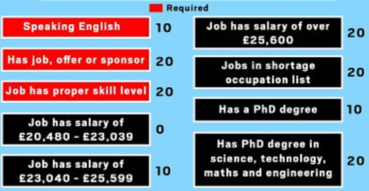

## Disclaimer

I am a British woman in my late 40s and I have never voted for the Conservative Party in any UK election. Local, national or EU. I probably never will.

I live in the "Red Citadel" of Liverpool and my Labour MP was elected in 2019 with nearly three quarters of the votes cast. I currently live on a low income in social housing, although I am taking steps to train for a new career.

The reason I need to make that disclaimer is that I am about to say some very positive things about the new Conservative immigration policy.

## The Needs of the Host Nation

Here is a graphic for the new policy, which will come into effect on January 1st 2021. A total of 70 points are required for immigrants to the UK.

The beauty of the new system is that it considers only what the host nation needs. Irrelevant characteristics like the nationalitity, race or religion of the applicant are ignored.

## English skills are rewarded

A "willingness to work" is no good at all if simple instructions from an employer or customer cannot be understood due to the language barrier. The new system puts an emphasis on English skills. The old system completely ignored them.

## A level playing field

The old system was two tier and discriminated strongly in favour of EU citizens. The new system only gives an edge to well-educated English speakers and those whose skills are in high demand. As it should be!

## STEM credentials are rewarded

Although I am currently applying for positions in the tech sector, I don't feel that I am in competition with foreigners. In fact, I don't even feel that I am in competition with my fellow Brits most of the time. The employer's minimum requirements are the real obstacle. Not the other applicants.

I am glad that the government is pulling out all the stops to ensure that Britain remains competitive in global tech.

## Foreign nurses are still very welcome

The same goes for any occupation in the "shortage" list. So please stop using nurses to justify open borders.

## There is no real shortage of cleaners, fruit pickers, bar staff or care workers

From various stories in the media it appears that employers paying poverty wages in the less desirable job categories such as fruit picking, cleaning, bar work and elderly care are lobbying government to increase the cap on the quota of workers allowed in these "shortage" categories.

Mass immigration has been used as a weapon of class warfare against the British working class from the 1960s onwards.

If we refuse poverty pay, then employers hire workers from abroad to drive down market wages. But in 2020, far from trying to sheild low paid British workers from these effects, the Labour Party surrogates praise foreign workers to the skies, while heaping scorn and derision on the native population. Calling us "xenophobes", "racists", and "gammons". Or accusing us of being "lazy" for not accepting the terms and conditions on offer.

> bRiTISH pEOple WonT dO tHESe jOBS

Has become the rallying cry of British middle class Remainers. That battle cry is largely responsible for the [collapse of Labour's voting base](https://www.theguardian.com/politics/2019/dec/13/labours-red-wall-demolished-by-tory-onslaught).

## Zuzanna doesn't want to bathe your bathe your nan for poverty wages, any more than we do

The only difference is that our hypothetical Polish immigrant knew that she would have to do that for a while as the "price of admission" to the UK. But if you think that her driving ambition is to wash old ladies arses thousands of miles away from her family, then I would humbly submit that you are wrong.

When she eventually does get a better job, or becomes eligible for state benefits, what was supposed to happen then? Would another EU citizen be required to replace her?

Equally, her hypothetical brother Aleksander doesn't want to pick fruit in Norfolk for the rest of his life. The real solution to the "labour shortage" in most cases, is to offer better pay and conditions to native workers. But that idea is dismissed out of hand by the modern British left.

In some instances though, particularly agriculture or assembly line work, automation would be a better fix. Im glad to report that Tory surrogates and MPs in the media are actually using the word "automation" now in interviews.

Finally, someone on the mainstream media is actually pointing out the [reality that we see all around us](https://www.youtube.com/watch?v=7Pq-S557XQU).
