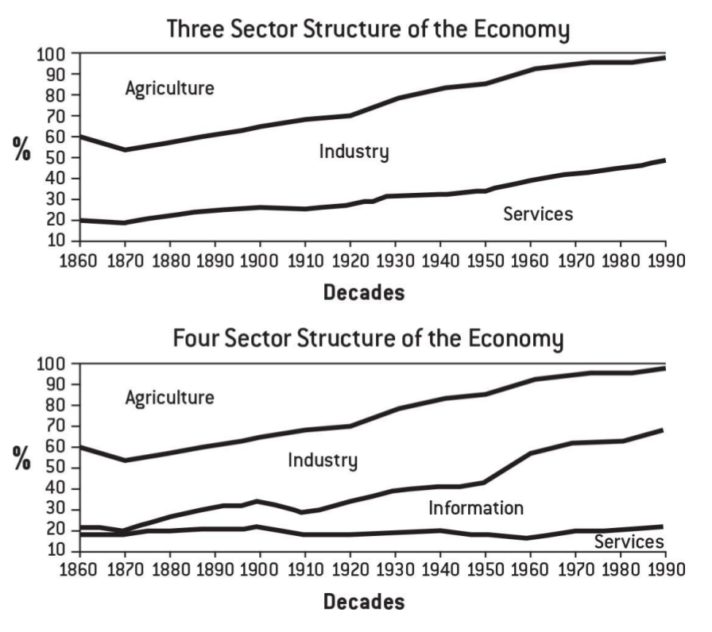

## Shout Outs

I would like to begin this post, and the blog as a whole, with a shout-out to my 2000th Twitter follower. A user with the handle [math_hatter](https://twitter.com/math_hatter).

I would also like to thank all the Twitter users who suggested topics for my blog. I went with "The Future Of Populism" for my debut post at the suggestion of [FreeMars2020](https://twitter.com/FreeMars2020), but I added the tagline myself.

## Andrew Yang

Like so many others, I discovered the 2020 US presidential candidate Andrew Yang after watching his interview with [Joe Rogan](https://www.youtube.com/watch?v=cTsEzmFamZ8). This was months after the video was posted, thanks to a suggestion from the YouTube algorithm.

I was fascinated by Yang's message of [Universal Basic Income](https://www.yang2020.com/what-is-freedom-dividend-faq/) and how he was able to put that policy proposal in a historical context which included [Thomas Paine](https://www.youtube.com/watch?v=CXv7aKvwt-A) and [Dr Martin Luther King](https://www.youtube.com/watch?v=FT2jpgSZSO0). I resisted getting a Twitter account for as long as I could, but in August 2019, I eventually succumbed to my curiousity and joined the platform.

## An addictive time-suck

Participating in the online #YangGang from my side of the Atlantic was just as time-consuming as I expected it to be. But I also had a blast and learned a hell of a lot. In the meantime, we had a General Election here in the UK and I cast my vote for the Green Party. Despite disgareeing with the Greens on many issues, they were the only UK party fielding candidates that put UBI in their manifesto. Not just "UBI trials", mind you. An actual [UBI policy](https://www.greenparty.org.uk/news/2019/11/15/green-party-announces-plan-for-fully-costed-universal-basic-income-for-everyone/).

But on February 11, 2020, after outlasting many of his Democrat nomination rivals, Yang announced the suspension of his presidential campaign. What happened next on Twitter really surprised me. I started to gain followers far more rapidly than I had before. Contrary to my pessimistic expectations, the Yang Gang's response to the suspension was to close ranks rather than disperse. I was delighted and awed by that. Even in the absence of Yang, a broad coalition remains and the political status quo just doesn't cut it for us.

## Post Mortems

Yang departure from the presidential race gave the Yang Gang time to pause and reflect on the campaign as a whole. Opinions were, as you might expect, rather divided on the question of why Yang's message hadn't landed with voters in the early voting states of Iowa and New Hampshire.

Many quite plausible theories emerged.

-   Was he too nice?
-   Were voters too dumb?
-   Did the #YangMediaBlackout ruin everything for us?
-   Were we lacking the "boots on the ground" for canvassing?
-   Were those eligible to vote even aware of his existence?

I think Yang's hands were tied. He could give dire warnings to the public about [job losses through automation](https://www.youtube.com/watch?v=FZ0f4GlbSUw), because while that message might be alarming, it wasn't a threat to the self-image of any workers in the present. But that was only half the story.

## Bullshit Jobs

I had been meaning to read David Graeber's ["Bullshit Jobs"](https://en.wikipedia.org/wiki/Bullshit_Jobs) for a while, but I was too wrapped up in Twitter and my efforts to master the basics of web development to get around to it. But with the lull in Yang Gang activity online, I finally read it.

> "...anthropologist David Graeber that argues the existence and societal harm of meaningless jobs. He contends that over half of societal work is pointless, which becomes psychologically destructive when paired with a work ethic that associates work with self-worth. Graeber describes five types of meaningless jobs, in which workers pretend their role is not as pointless or harmful as they know it to be: flunkies, goons, duct tapers, box tickers, and taskmasters. He argues that the association of labor with virtuous suffering is recent in human history, and proposes universal basic income as a potential solution."

Sadly, most of the articles and podcasts devoted to Graeber's ideas focus exclusively on the useless, soul-destroying nature of most modern work and largely ignored the question of how bullshit jobs came to be such a large portion of the modern economy in developed countries.

However, chapter five of Graeber's book attempts to answer the "why?" question.

> Economies around the world have, increasingly, become vast engines for producing nonsense. How did this happen? And why has it received so little public attention? One reason it has been so little acknowledged, I think, is that under our current economic system, this is precisely what is not supposed to happen: in the same way as the fact that so many people feel so unhappy being paid to do nothing defies our common assumptions about human nature, the fact that so many people are being paid to do nothing in the first place defies all our assumptions about how market economies are supposed to work.

I too, believed that capitalism was all about ruthless economic efficiency. Until I got my first job in the private sector and I quickly realised that wasn't the case. However, even though these jobs were nominally in the "private sector", there always seemed to some tie to government. If not a government contract, then a regulatory burden enforced by government or some revenue stream from government at the level of the EU, UK central government or the local authority.

> For much of the twentieth century, state Socialist regimes dedicated to full employment created bogus jobs as a matter of public policy, and their social democratic rivals in Europe and elsewhere at least colluded in featherbedding and overstaffing in the public sector or with government contractors, when they weren’t establishing self-conscious make-work programs like the Works Progress Administration (WPA), as the United States did at the height of the Great Depression. All of this was supposed to have ended with the collapse of the Soviet bloc and worldwide market reforms in the nineties. If the joke under the Soviet Union was “We pretend to work; they pretend to pay us,” the new neoliberal age was supposed to be all about efficiency. But if patterns of employment are anything to go by, this seems to be exactly the opposite of what actually happened after the Berlin Wall came down in 1989.

As I see it, Bullshit Jobs have four sources in government :

-   Direct employment by the state
-   Indirect employment by the state through government contracts
-   Regulatory burdens placed on private sector businesses by government
-   Exploitation of government funding, incentives and subsidies by the private sector

In addition, individual managers can seek to inflate the importance of their own position, by expanding the ranks of their underlings. Graeber gives examples of this in Chapter Two of his book.

# Politicians response to automation

Job losses directly caused by automation are a favourite topic for UBI advocates such as myself. So are the record profits and GDP growth obtained by getting machines to do work instead of paid employees. Yang expressed this tension eloquently.

> "If these are your measurements, then of course you're going to think things are going in one direction, while your way of life disintegrates. Even the inventor of GDP, Simon Kuznets, said 100 years ago, this is a terrible measurement of national well-being, and we should never use it as that."

But there is often the perception both among the #YangGang and the public in general, that politicians are currently "doing nothing" about the threat of automation to the workforce. I used to hold that view myself. I would see retail outlets close and supermarket cashiers be replaced with self-checkouts. I would also notice when call handlers were replaced with automated services. That was my initial motivation for supporting Yang.

But the reality is that politicans are doing something about automation. In fact, they have been doing something about it for as long as governments have existed. Why?

Because voters were dumb enough to demand this of them at election time. Or in the case of totalitarian regimes, dumb enough to make bloody revolutions, impose tyranny and even start wars in the name of job creation!

In order to keep unemployment down, government used the four methods I mentioned above. Here they are again, so you don't have to scroll up.

-   Direct employment by the state
-   Indirect employment by the state through government contracts
-   Regulatory burdens placed on private sector businesses by government
-   Exploitation of government funding, incentives and subsidies by the private sector

# A graph of bullshit job creation

While statistics on bullshit jobs have to rely on self-reported dissatisfaction with work, breakdowns of the work-force by sector aren't so difficult to obtain. For example, Graeber's book has these illuminating graphs

The "information" portion of the second graph looks rather suspicious doesn't it? While I'm not claiming that all information sector workers are performing bullshit jobs, the numbers of us working in offices is highly suspicious.

Will any politician call that out? That's doubtful in our present day culture. Politicians like to be popular. Telling half the workforce that their jobs are nonsense and shouldn't exist, could make you a lot of enemies very quickly. Yet intuitively, and in our own experience, many of us suspect that this is the case.

Although popular culture has given us glimpses of the realisation that most contemporary work is both pointless and soul destroying as early as Fritz Lang's [Metropolis](https://www.youtube.com/watch?v=0mK46KprASM) (1927) or with the much more recent movie [Office Space](https://www.youtube.com/watch?v=jsLUidiYm0w) (1999).

In the present day, [4Chan NEETS](https://www.youtube.com/watch?v=NJW_av0PQXM) have become a cultural movement unto themselve, while Josh Fluke's YouTube channel has become a homage to [Corporate Cringe](https://www.youtube.com/watch?v=0GsxwEhQuWI).

# Personal anecdotes

With the obligatory disclaimer that the plural of "anecdote" isn't "data", my own recent work history as a temp makes me the poster girl for Graeber's thesis. Without doxing myself, I will give brief details of some gig economy jobs I worked at.

-   a tech support job where I simply relayed information to customers that was all freely available on the company website.
-   a role working for a private contractor on a government savings scheme, taking enquiries, relaying on-screen information and sending out paperwork through the mail.
-   an admin position for a training provider, where I cold-called former students to check if they were currently employed, so that details of students in employment could be used to claim money from a government retraining budget.
-   an inbound call centre position working for a contractor in the back offices of a major international bank, implementing a customer compensation scheme as mandated by a government regulator. I only took three calls from customers in two months!
-   a role working for an agency, based at the offices of a government contractor where I booked appointments for EU citizens to have "Evidence of Identity" interviews so that these EU citizens could recieve National Insurance numbers which would facilitate them finding employment in the UK.

# Why the hell are they paying me to do this stupid crap?

That was the thought rattling around my brain while working those jobs. Not so much, "what's in it for me?" as "what's in it for them?". Four of those five jobs had ties to the government. But the tech support job could - perhaps - be justified as a PR exercise.

I don't think of myself as an abberation in this respect. In fact, I see my experience as being utterly typical for most [call centre workers](https://www.youtube.com/watch?v=6It6SnNwsh8) in the present day UK.

# Culture vs Politics

I don't fault Andrew Yang as a political candidate for focusing on the UBI half of modernity and not the awkward conversation about pointless work. After all, he had to convey a simple and memorable message that wouldn't offend people. "Automation is coming for your job" and "I want to give every American adult \$1000/month" are simple and memorable messages.

But the public conversation that we need to have now is a painful one. We need to talk about what has happened in the last 40 years of automation. Not just the next 40 years. Government's desperate struggle to find new occupations for its workforce, even at the price of filling the country with unproductive nonsense jobs. This needs to be exposed and no politician wants to be the bearer of bad news like that. The proverbial messenger wouldn't just be "shot". They would also be hung, drawn and quartered online.

Therefore UBI politics cannot be our only angle of attack on the Citadel of Bullshit. Savage cultural critique and weapons grade meme magic needs to be employed against the absurdity of the modern workplace, and the political establishment that created it. But at all times, we must have the awareness in our minds that stupid politicians were ultimately doing the bidding of stupid voters who demanded that these new jobs be created. We have met the enemy, and they are us!

# Meaning and Dignity

Anyone foolish enough to claim that "jobs give us meaning and dignity" has definitely conflated [jobs with careers](https://www.youtube.com/watch?v=tA8gl7ANr-U). Yet, I have no doubt that there are still many gruelling yet economically useful, non-bullshit jobs out there today.

But let's first dispose of the greulling and useless jobs which only exist due to government intervention. These deserve to be lampooned to death and the perverse incentives that created them also need to be exposed and crushed.

Humanity's next task is to dispense with the arduous yet currently necessary jobs as much as we can through automation and innovation. That of course, is a technological struggle, not a political one.

Anyone who fears a human future filled with leisure needs to take a long, hard look in the mirror. To pause and reflect on their priorities. If you have a significant other to embrace, children to play with, friends to talk to, family to visit, a dog to walk, a cat to stroke, sports to play, games to pursue, projects to engage with, books to write or studies to undertake, then should not fear leisure at all.

If work is the only way to save your sanity, then frankly, I pity you.
